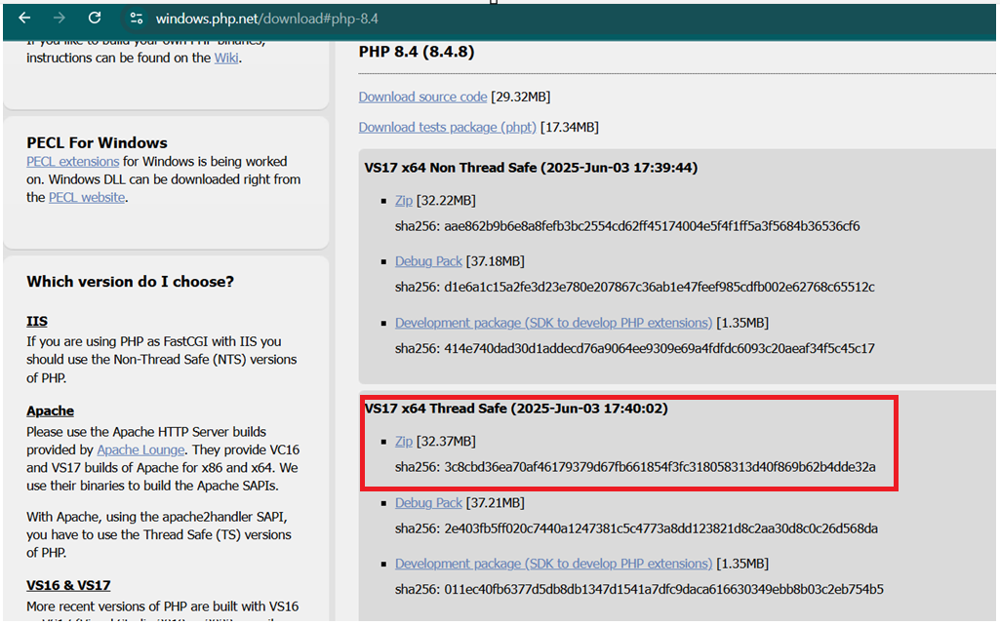

# PHP Installation on Windows & How to run this PHP application

Follow these steps to install PHP on Windows:

## 1. Download PHP
- Visit the [official PHP downloads page](https://www.php.net/downloads.php).
- Go to WIndows downloads   
- Choose the latest **Thread Safe** ZIP file for your system (x64 or x86).
 

## 2. Extract Files
- Extract the ZIP file to a folder, e.g., `C:\php`.

## 3. Configure PHP (optional)
- Rename `php.ini-development` to `php.ini`.
- Open `php.ini` in a text editor and adjust settings as needed (e.g., enable extensions).

## 4. Add PHP to System Path or User Path
- Open **System Properties** > **Advanced** > **Environment Variables**.
- Edit the `Path` variable and add the path to your PHP folder (e.g., `C:\php`).

## 5. Verify Installation
- Open **Command Prompt** and run:
    ```
    php -v
    ```
- You should see the PHP version information.

## 6. Navigate to this folder: `ai\agents\php`
- Open **Command Prompt** and change directory to your project folder:
    ```
    cd path\to\ai\agents\php
    ```

## 7. Run the PHP Application
- Start the built-in PHP server by running:
    ```
    php -S localhost:8000
    ```
- Open your browser and go to [http://localhost:8000](http://localhost:8000) to view the application.