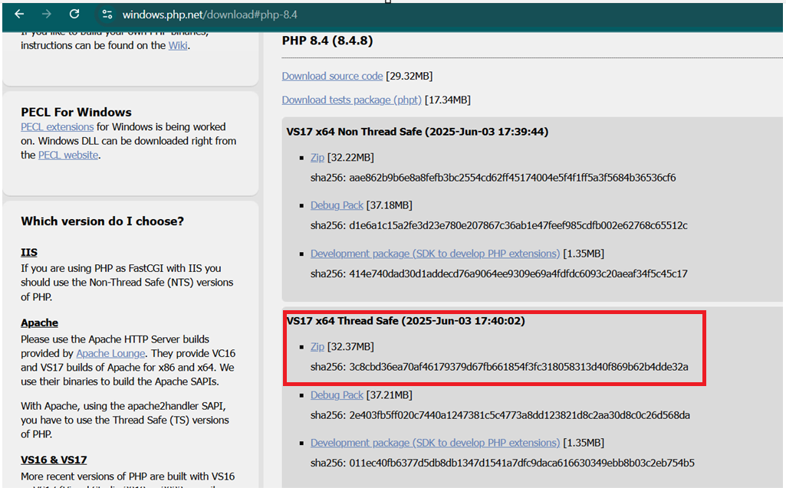

# PHP Installation on Windows

Follow these steps to install PHP on Windows:

## 1. Download PHP
- Visit the [official PHP downloads page](https://www.php.net/downloads.php).
- Go to WIndows downloads   
- Choose the latest **Thread Safe** ZIP file for your system (x64 or x86).
 

## 2. Extract Files
- Extract the ZIP file to a folder, e.g., `C:\php`.

## 3. Configure PHP (optional)
- Rename `php.ini-development` to `php.ini`.
- Open `php.ini` in a text editor and adjust settings as needed (e.g., enable extensions).

## 4. Add PHP to System Path
- Open **System Properties** > **Advanced** > **Environment Variables**.
- Edit the `Path` variable and add the path to your PHP folder (e.g., `C:\php`).

## 5. Verify Installation
- Open **Command Prompt** and run:
    ```
    php -v
    ```
- You should see the PHP version information.

## 6. (Optional) Install a Web Server
- For local development, install [XAMPP](https://www.apachefriends.org/), [WampServer](https://www.wampserver.com/), or configure Apache/Nginx manually.

---

**References:**
- [PHP for Windows Documentation](https://windows.php.net/docs/)
- [PHP Manual](https://www.php.net/manual/en/install.windows.php)