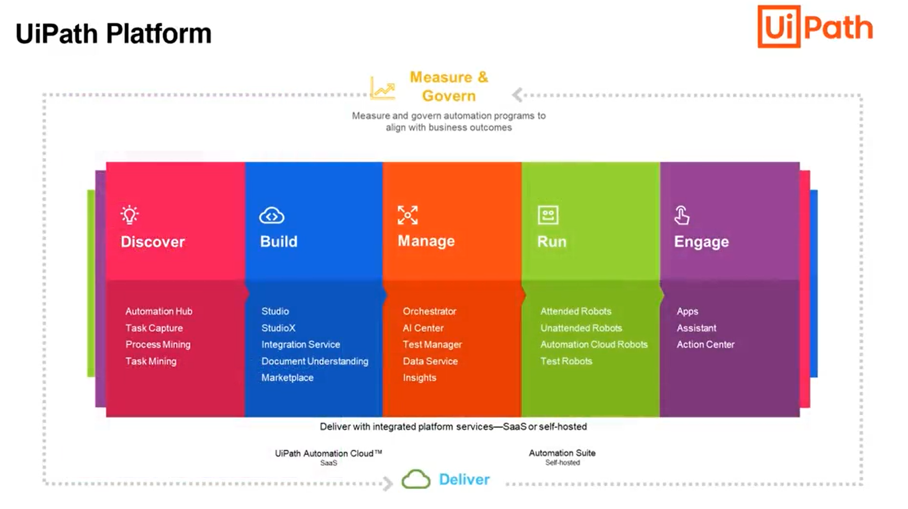
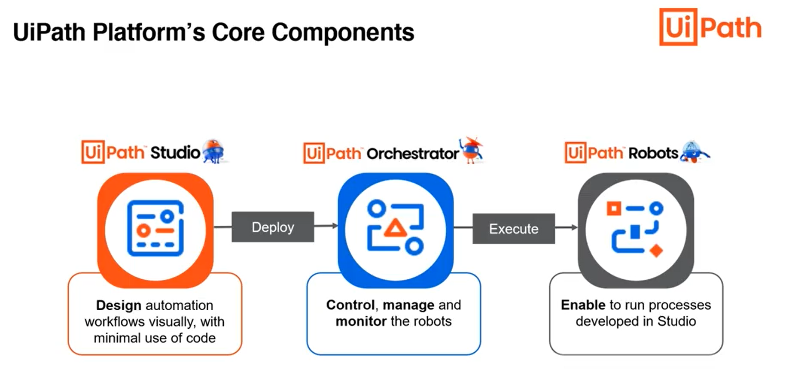

# Basics

1. Automation is the technology by which you execute a process or procedure with minimal human assistance.

2. Robotic process automation is a technology that enables a software program to mimic the human actions to 
interact with computer appications to accomplish required tasks.
Ex: Keyboard inputs, mouse movements and clicks, reading computer screens etc

Benefits:
- Build this automation using low code
- RPA is faster and efficient
- Frees up human bandwidth for productive work

Features of RPA:
1. Supports different computer applications such as browser, excel etc
2. Can work 24X7 wihtout making errors, without taking a break etc
3. It creates a digital workforce

Benefits:
1. Speed of execution
2. Efficient usage of resources
3. Improved accuracy
4. Easier Scaling
5. Improved compliance and governance
6. Rapid ROI

# UiPath

1. It is a leading global RPA software company.
2. It is a platform which has Discover, Build, Manage, Run & Engage components.

    

3. Ui Path's core components

    

4. Types of robots

    a. Attended robots
    b. Unattended robots

