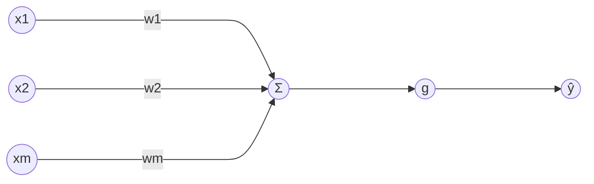

# Deep Learning

## Perceptron

The perceptron is the fundamental unit of a neural network.

Inputs: $x_1, x_2, \dots, x_m$  
Weights: $w_1, w_2, \dots, w_m$  
Linear combination: $\sum_{i=1}^{m} x_i w_i$  
Non-linearity (activation): $g(\cdot)$  
Output: $\hat{y}$

$$
\hat{y} = g\left(\sum_{i=1}^{m} x_i w_i\right)
$$