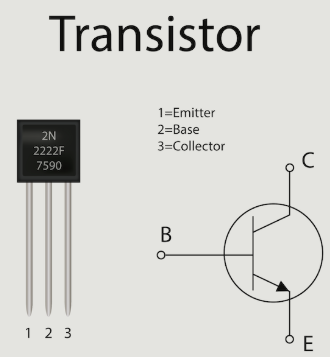

# Decoding the Chips

# Fundamental unit

- 
- Transistor: Semiconductor device to switch or amplify signals. 
              It has 3 components: Collector, Base and Emitter.
              Using base we control the flow of electricity.
              

- Logic gates: Abstraction over transistors. This is to make concept understanding easier.
               These are nothing but transistors put in a certain way to perform binary operations.
               Ex: Logic gate board kit can be brought to study different logic gates.
 

# Photolithography process

- The tranistors are printed (patterned) on the silicon wafer.
- 