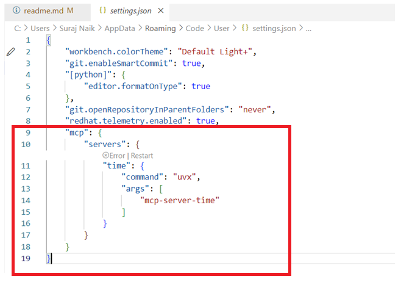

# Basic MCP Server

This project demonstrates how to leverage basic TIME -  MCP(Model Context Protocol) server.

## Getting Started

Before you begin, ensure you have the following prerequisites:

- **Docker**: Install Docker from [https://www.docker.com/get-started](https://www.docker.com/get-started).
- **GitHub Personal Access Token (PAT)**: Create a token by following the instructions at [Creating a personal access token](https://github.com/settings/personal-access-tokens/new).
- **uv**: Install the `uv` command line tool using pip:
    ```sh
    pip install uv
    ```
    For more details, see the [uv GitHub repository](https://github.com/astral-sh/uv).

Once you have these prerequisites, follow the steps below to set up the project.

1. **Clone the repository:**
    ```sh
    git clone https://github.com/yourusername/BasicMCP.git
    cd BasicMCP
    ```

2. **Install dependencies:**
    ```sh
    npm install
    ```

3. **Update the usersettings.json in VS Code:**

    

## Usage

- Access the MCP server at `http://localhost:PORT` (replace `PORT` with your configured port).
- Use the web interface or API to manage your Minecraft server.

## Configuration

Edit `config.json` to set server options such as port, authentication, and Minecraft server path.

## License

MIT