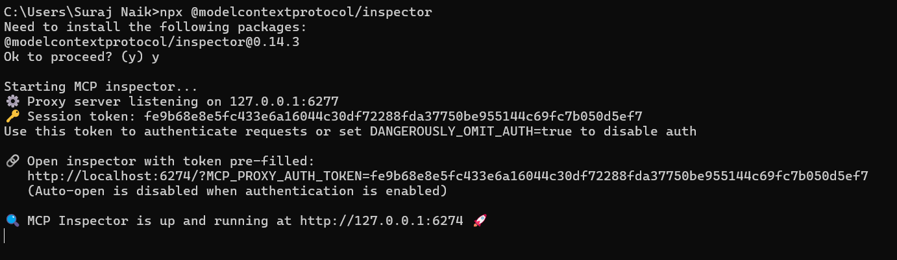
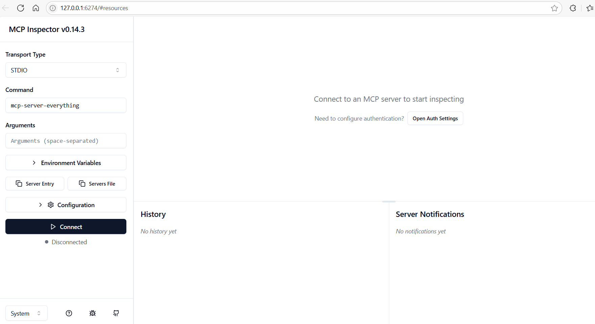

#Core concepts:

 Underlying protocol: JSON-RPC - Light weight remote procedure protocol. 

 Core components:

 1. Protocol layer
 2. Transport layer
        a. stdio
        b. Streamable http
 3. Message types

#Debugging MCP

1. Install MCP Inspector

    Open Command prompt and run this:
        npx @modelcontextprotocol/inspector

2. 

3. Browser view of MCP Inspector

    

4. 